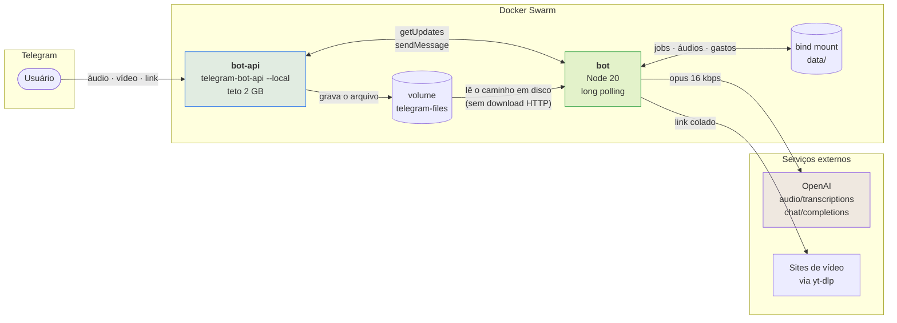
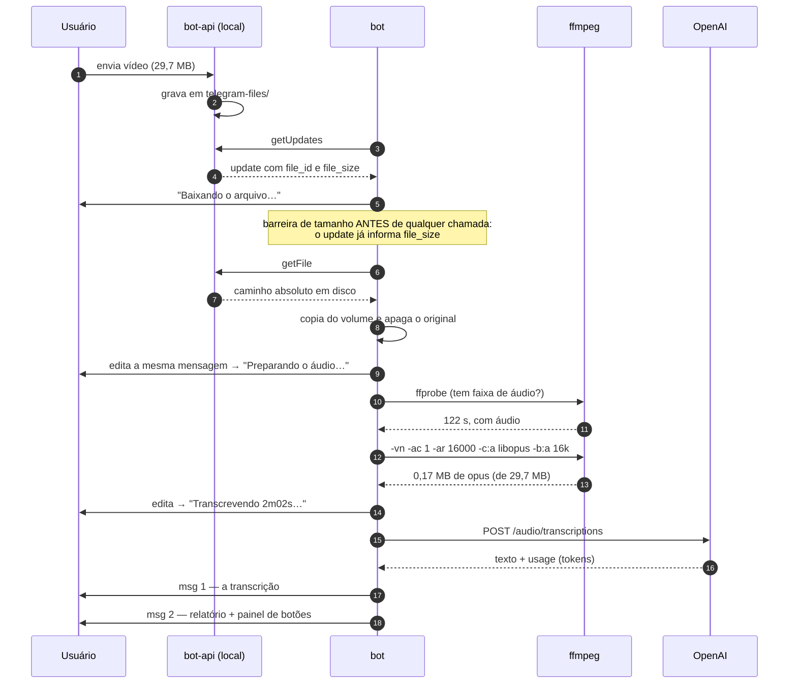
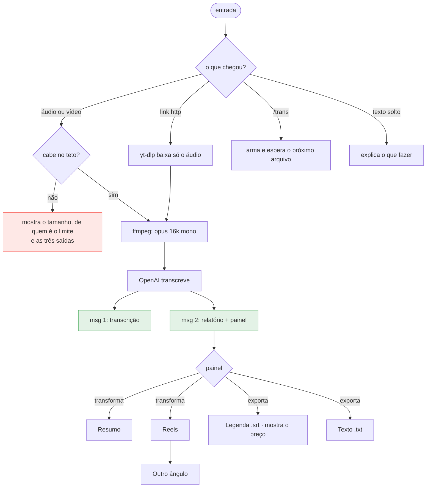
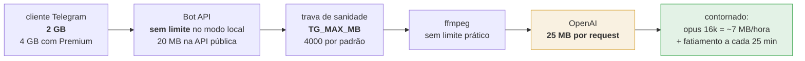

# transcritor

Bot de Telegram que transforma áudio e vídeo em texto, e o texto em coisas úteis:
resumo, legenda `.srt` com marcação de tempo e legenda de Reels pronta para
publicar. Roda em Docker Swarm, usa a API da OpenAI para transcrever e devolve o
custo exato de cada trabalho junto com o resultado.

```
você manda um áudio  →  transcrição em segundos  →  botões: resumo, Reels, .srt, .txt
                        + relatório com tokens, tempo de cada etapa e custo em R$
```

---

## Sumário

- [O problema](#o-problema)
- [Arquitetura](#arquitetura)
- [Fluxo de uma transcrição](#fluxo-de-uma-transcrição)
- [A árvore de interação](#a-árvore-de-interação)
- [Limites reais, em cadeia](#limites-reais-em-cadeia)
- [Custo](#custo)
- [Instalação](#instalação)
- [Configuração](#configuração)
- [Estrutura](#estrutura)
- [Documentação técnica](#documentação-técnica)

---

## O problema

Transcrever áudio é fácil; o que dá trabalho é tudo em volta. Formato errado,
vídeo que precisa virar áudio antes, arquivo grande demais para o canal, custo
invisível, e o texto cru que ainda não serve para nada sem edição.

Este projeto resolve os quatro:

| Incômodo | Como é resolvido aqui |
|---|---|
| "Que formato ele aceita?" | Qualquer um que o `ffmpeg` leia — inclusive vídeo, de onde o áudio é extraído automaticamente |
| "Meu arquivo é grande demais" | Servidor Bot API próprio: o teto sai de 20 MB e vai a 2 GB |
| "Quanto isso me custou?" | Cada resposta traz tokens, tempo por etapa e custo em USD e BRL |
| "O texto cru não serve para publicar" | Um clique vira resumo, legenda `.srt` ou copy de Reels com hashtags de SEO |

---

## Arquitetura



Dois containers, um volume compartilhado, nenhuma porta exposta à internet. O
bot não tem servidor HTTP: fala com o Telegram por long polling e com a OpenAI
por saída HTTPS. Não há o que atacar de fora.

**Por que um servidor Bot API próprio.** Na API pública, `getFile` recusa
qualquer arquivo acima de 20 MB — cerca de um minuto e meio de vídeo de celular.
Com o servidor local o teto vai a 2 GB e, de brinde, o Telegram passa a entregar
o **caminho do arquivo em disco** em vez de uma URL: como os dois containers
compartilham o volume, a etapa de download desaparece.

---

## Fluxo de uma transcrição



O usuário vê **uma** mensagem de progresso que se reescreve, nunca uma cascata.
Números reais, medidos neste vídeo de 29,7 MB: 3,5 s para obter o arquivo, 1,3 s
de conversão, 3,6 s de transcrição, US$ 0,0089 no total.

---

## A árvore de interação

Um critério organiza tudo: **botão pertence ao objeto, comando pertence ao
sistema**. Gastos e troca de modelo não são propriedades daquela transcrição —
por isso são comandos, e não botões competindo por atenção no painel.



O painel tem dois planos e quatro botões, nunca cinco:

| | transforma o texto | exporta o texto |
|---|---|---|
| **linha 1** | `Resumo` | `Reels` |
| **linha 2** | | |
| | `Legenda .srt · R$ 0,03` | `Texto .txt` |

Quatro regras sustentam isso:

1. **Nunca cobrar duas vezes.** Resumo e Reels ficam guardados no job. Reclicar
   reentrega de graça, e o rótulo passa a `Resumo (pronto)`.
2. **O rótulo carrega o preço quando a ação gasta.** Só o `.srt` gasta — exige
   re-transcrição no `whisper-1`, o único modelo que devolve marcação de tempo.
   O valor é calculado da duração real daquele áudio.
3. **O painel se repinta no lugar.** `editMessageReplyMarkup` na própria
   mensagem: nada de cascata, nada de botão que mente sobre o estado.
4. **Nível 2 só onde acrescenta.** Resumo é terminal, não ganha botão. Reels
   ganha `Outro ângulo`, porque ali repetir é a intenção — e os ganchos já
   usados entram no prompt como proibição, senão o modelo devolve a mesma ideia
   com outras palavras.

---

## Limites reais, em cadeia

O teto que vale é sempre o menor da cadeia. Todos foram medidos, não estimados:



O limite da OpenAI parece o mais apertado, mas nunca é atingido: a normalização
para opus 16 kbps mono derruba uma hora de fala para cerca de 7 MB. Um vídeo de
29,7 MB virou **0,17 MB** de áudio. Acima de 25 minutos o áudio é fatiado, e o
deslocamento de cada pedaço é somado de volta nos tempos do `.srt` — testado com
27 minutos contínuos, junção conferida bloco a bloco.

---

## Custo

Medições reais deste projeto, com `gpt-4o-transcribe` e `gpt-4.1-mini`:

| Trabalho | Duração | Custo | Em reais |
|---|---|---|---|
| Áudio de voz | 64 s | US$ 0,0065 | R$ 0,035 |
| Vídeo de 29,7 MB | 122 s | US$ 0,0089 | R$ 0,048 |
| Resumo | — | US$ 0,00027 | R$ 0,0015 |
| Legenda de Reels | — | US$ 0,00047 | R$ 0,0025 |
| Legenda `.srt` (whisper-1) | por minuto | US$ 0,006/min | R$ 0,032/min |

Uma hora de vídeo transcrita custa cerca de **US$ 0,34**. A tabela de preços vive
em um só arquivo, [`lib/precos.js`](lib/precos.js) — não há preço espalhado pelo
código. O acumulado por dia fica em `data/gastos.json` e sai em `/gastos`.

---

## Instalação

Pré-requisitos: Docker em modo Swarm, uma rede overlay externa e uma chave da
OpenAI.

```bash
git clone https://github.com/<usuario>/transcritor.git /opt/transcritor
cd /opt/transcritor
cp .env.example .env && $EDITOR .env      # TG_CHAT_ID, rede, diretório

# segredos — nenhum deles fica em arquivo de configuração
printf '%s' "SEU_TOKEN_DO_BOTFATHER"  | docker secret create tg_bot_token -
printf '%s' "sk-..."                  | docker secret create openai_api_key  -

./deploy.sh
```

O bot já funciona assim, com teto de 20 MB por arquivo. Para levar o teto a
2 GB, veja [servidor Bot API próprio](docs/OPERACAO.md#servidor-bot-api-próprio)
— são duas credenciais de `my.telegram.org` e um `logOut`.

---

## Configuração

Tudo por variável de ambiente, no `stack.yml`:

| Variável | Padrão | Para que serve |
|---|---|---|
| `TG_CHAT_ID` | — (obrigatória) | Único chat autorizado. Qualquer outro recebe "Bot particular." |
| `MODELO_TRANSCRICAO` | `gpt-4o-transcribe` | Motor padrão. `/modelo` troca em runtime |
| `MODELO_TEXTO` | `gpt-4.1-mini` | Usado por resumo e Reels |
| `USD_BRL` | `5.40` | Câmbio de referência do relatório |
| `BLOCO_SEGUNDOS` | `1500` | Fatia o áudio a cada 25 min |
| `VALIDADE_DIAS` | `14` | Retenção de transcrições e áudios |
| `AUTO_TRANSCREVER` | `1` | Aceita mídia sem exigir `/trans` antes |
| `LINK_MAX_MB` | `500` | Teto do download por link |
| `TG_API_BASE` | API pública | Aponta para o servidor próprio |
| `TG_MAX_MB` | `4000` | Trava de sanidade no modo local |

Segredos entram por `docker secret`, montados em `/run/secrets/` — nunca por
variável de ambiente, que apareceria em `docker service inspect`.

---

## Estrutura

```
transcritor/
├── index.js              laço de updates, roteamento, orquestração do job
├── lib/
│   ├── telegram.js       cliente da Bot API (público e local), picote de mensagem
│   ├── media.js          ffprobe, normalização para opus, fatiamento
│   ├── openai.js         transcrição e escrita, cada uma já devolvendo o custo
│   ├── link.js           yt-dlp, cookies por domínio, tradução de erro
│   ├── copy.js           prompts de resumo e Reels, montagem do .srt
│   ├── precos.js         tabela de preços — fonte única
│   └── estado.js         persistência de jobs, áudios e contabilidade
├── scripts/smoke.js      teste de fumaça: ffmpeg + OpenAI, sem Telegram
├── stack.yml             os dois serviços, secrets, volumes
└── docs/                 arquitetura, decisões e runbook
```

---

## Documentação técnica

- [**Arquitetura**](docs/ARQUITETURA.md) — módulos, contratos de dados, ciclo de
  vida, concorrência e modos de falha
- [**Decisões**](docs/DECISOES.md) — por que cada escolha, e o que foi descartado
- [**Operação**](docs/OPERACAO.md) — deploy, rollback, migração para servidor
  próprio, rotação de segredo, diagnóstico

---

## Histórico

Mudanças por versão em [CHANGELOG.md](CHANGELOG.md).

## Licença

MIT. Veja [LICENSE](LICENSE).
