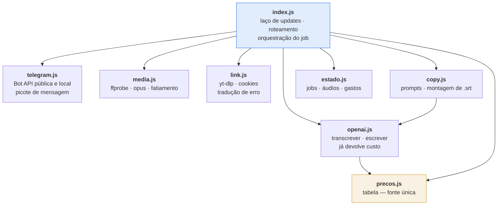
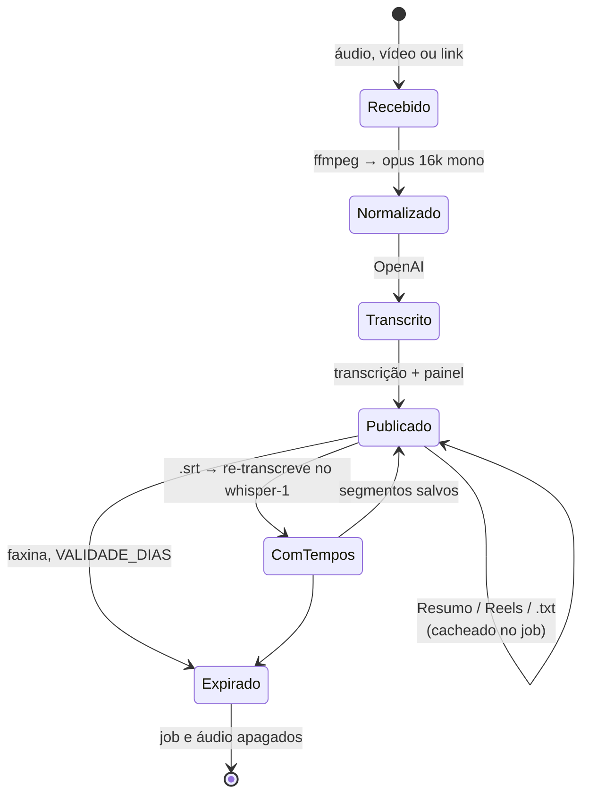

# Arquitetura

## Princípio

Um processo, sem servidor HTTP, sem banco. O estado que precisa sobreviver a um
redeploy cabe em arquivos JSON; o resto é memória. Essa escolha define quase
tudo o que vem abaixo — e tem limite conhecido, descrito em
[Concorrência](#concorrência).

## Módulos e fronteiras



Regras de dependência que valem como contrato:

- **Nenhum módulo de `lib/` conhece o `index.js`.** Todos são chamáveis de um
  script solto — é o que permite o teste de fumaça rodar sem Telegram nenhum.
- **Só `openai.js` fala com a OpenAI**, e toda resposta sua já vem com o custo
  calculado. Custo não é uma preocupação de quem chama.
- **Só `precos.js` conhece preço.** Se a OpenAI mexer na tabela, muda um arquivo.
- **`copy.js` não faz I/O de rede diretamente**: usa `openai.js`. Ele é a camada
  de *prompt*, não de transporte.

## Contrato do job

Cada transcrição vira um arquivo em `data/jobs/<id>.json`. É o que os botões
leem, e é por isso que eles continuam funcionando depois de um redeploy:

```jsonc
{
  "id": "mfk3a9x2",              // base36 do relógio + 4 aleatórios
  "chat": 123456789,
  "criado": 1756000000000,
  "arquivo": {
    "nome": "amostra.mp4",
    "tipo": "arquivo",           // audio de voz | vídeo | link · Instagram | ...
    "bytes": 31138611,           // original
    "bytesOpus": 178234,         // depois da normalização
    "duracao": 122.4
  },
  "texto": "…",                  // transcrição completa
  "segmentos": [                 // só existe depois que alguém pediu .srt
    { "inicio": 0.0, "fim": 5.84, "texto": "…" }
  ],
  "modelo": "gpt-4o-transcribe",
  "tokens": { "audio_in": 1220, "text_out": 180 },
  "partes": 1,                   // quantos pedaços o áudio precisou
  "ms": { "baixar": 3500, "ffmpeg": 1300, "openai": 3600 },
  "custo": { "usd": 0.0089 },
  "audio": "/app/data/audios/mfk3a8.ogg",  // guardado para gerar .srt depois
  "painel": 42,                  // message_id da mensagem que segura os botões
  "resumo": { "texto": "…", "modelo": "…", "usd": 0.00027 },
  "reels":  { "segmento": "…", "gancho": "…", "hashtags": ["…"], "usd": 0.00047 },
  "reelsVersoes": []             // histórico, alimenta a proibição de repetir ângulo
}
```

Os campos `resumo`, `reels` e `segmentos` são **preguiçosos**: só existem depois
que o usuário pediu. A presença deles é o que faz o rótulo do botão virar
`(pronto)` e o reclique sair de graça.

## Ciclo de vida dos dados



Três lugares guardam bytes, e cada um tem dono:

| Onde | O que | Quem apaga |
|---|---|---|
| `data/jobs/` | JSON da transcrição | faxina por mtime, a cada 6 h |
| `data/audios/` | opus normalizado, para gerar `.srt` depois | mesma faxina |
| volume `telegram-files` | arquivo cru entregue pelo servidor local | **o bot**, logo após copiar |

A terceira linha é uma armadilha conhecida do `telegram-bot-api --local`: **ele
não limpa o que baixa**. Sem o `unlink` explícito, todo vídeo enviado ficaria no
volume para sempre. O diretório temporário de trabalho é `mkdtemp` e morre em
`finally`, dê certo ou não.

## Concorrência

O laço é sequencial: um `getUpdates` de cada vez, updates processados em ordem.
Sobre isso há duas travas:

- **`ocupado`** — um `Set` de chats em processamento. Mandar outro arquivo antes
  do anterior terminar recebe recusa explícita, não uma fila silenciosa.
- **`replicas: 1` e `order: stop-first`** — a Bot API admite **um** leitor de
  `getUpdates` por token. Duas réplicas, ou um rolling update `start-first`,
  colocariam dois pollers no ar disputando os mesmos updates. Isso não degrada:
  quebra, e de forma intermitente, que é pior.

Limite honesto dessa escolha: `armado` e `ocupado` vivem em memória, então um
redeploy no meio de um trabalho perde o estado *daquele* trabalho. O job já
salvo em disco sobrevive; o que estava em voo, não.

## Modos de falha

| Falha | Sintoma | Tratamento |
|---|---|---|
| Arquivo acima do teto | `getFile: file is too big` | Barrado **antes** da chamada, pelo `file_size` que o próprio update informa |
| Sem faixa de áudio | vídeo mudo, imagem com trilha vazia | `ffprobe` detecta e para ali, sem gastar API |
| Site exige login | 403 ou "Sign in to confirm" | Erro traduzido para instrução acionável, não stack trace |
| Áudio maior que 25 min | passaria do teto da OpenAI | Fatiado, com deslocamento somado nos tempos do `.srt` |
| Telegram devolve 429 | rate limit | Respeita o `retry_after` e repete |
| Rota IPv6 morta | cada chamada demora ~25 s | `dns.setDefaultResultOrder('ipv4first')` |
| Entidade HTML partida ao meio | "can't parse entities" | Picote acontece no texto **cru**; o escape é aplicado por bloco |
| OpenAI fora do ar | exceção na transcrição | Mensagem de erro no chat, job não é criado, temporário é apagado |

## Segurança

- **Um chat autorizado.** `TG_CHAT_ID` é verificado tanto em mensagem quanto em
  clique de botão. Qualquer outro chat é ignorado **em silêncio** e registrado no
  log: responder confirmaria a existência do bot a quem estivesse sondando, e
  transformaria o serviço em eco de quem mandasse volume.
- **Segredos só por `docker secret`**, lidos de `/run/secrets/`. Nada em variável
  de ambiente — `docker service inspect` mostraria.
- **Nenhuma porta publicada, e rede exclusiva.** Os dois serviços vivem numa
  overlay própria da stack — nenhum outro container da máquina resolve o nome do
  `bot-api`, quanto mais o alcança. Não há superfície HTTP para fora nem para os
  vizinhos.
- **Cookies são credencial**, tratados como tal: montados somente-leitura,
  copiados para área temporária a cada uso (o `yt-dlp` reescreve o arquivo), e
  fora do versionamento.
